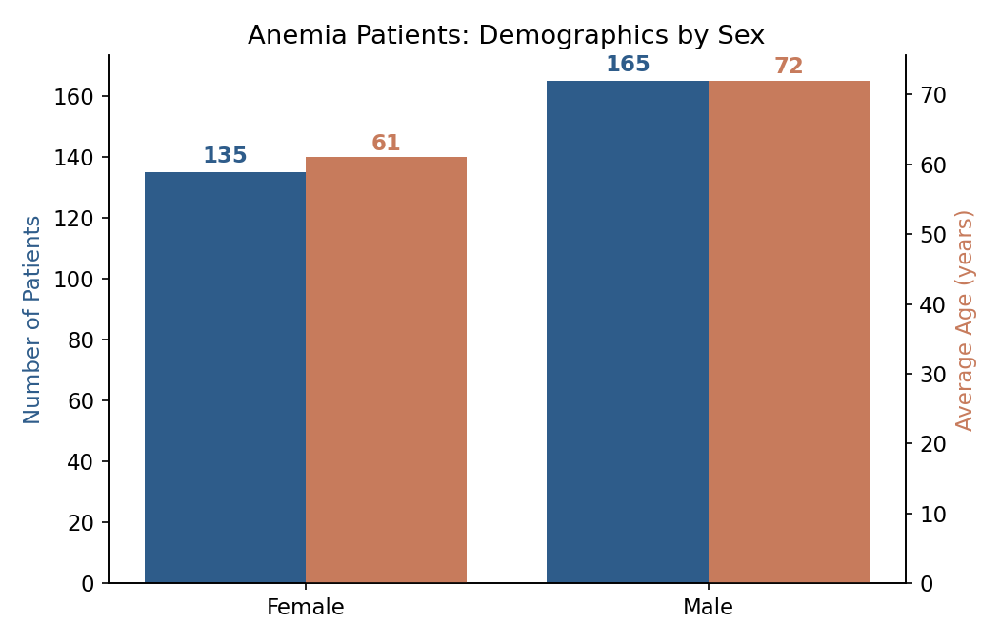
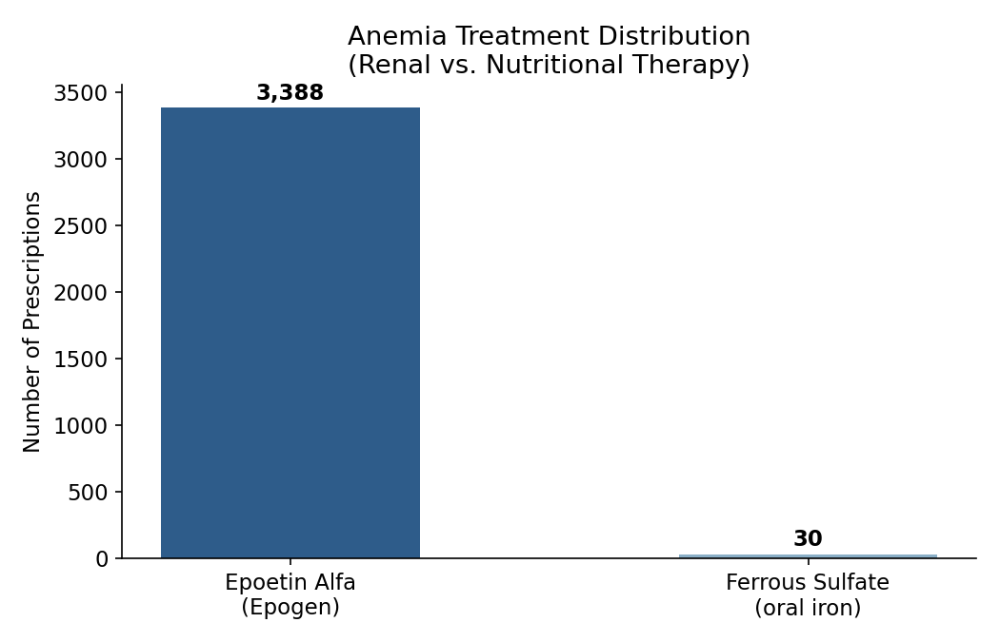
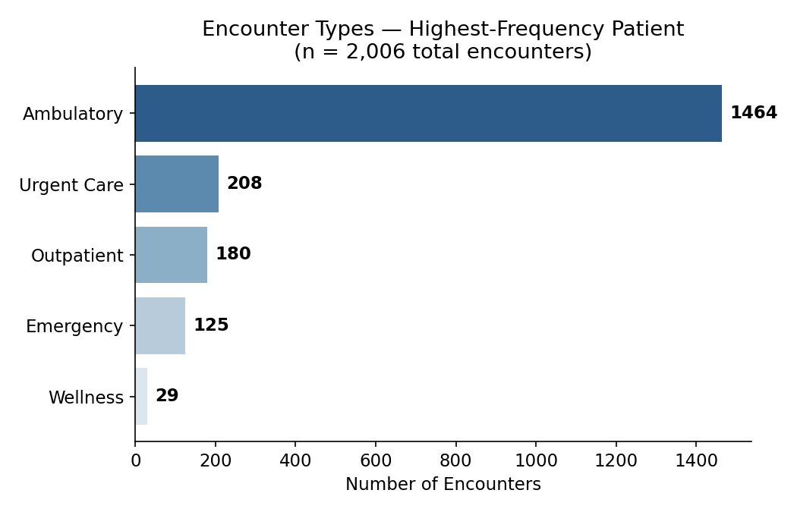

# Hematology Patient Population Analysis: SQL Deep Dive (Synthea Synthetic Data) 
## Project Overview 
This project presents an end-to-end SQL analysis of a synthetic patient population generated by Synthea, an open-source synthetic patient simulator (MITRE). The objective was to identify the hematology-related patient subpopulation within the dataset and apply progressively advanced SQL techniques to uncover clinically meaningful patterns in diagnosis, treatment, and healthcare utilization. 
## Objectives 
-	Identify and isolate the hematology-related patient population. 
-	Clean and prepare imported data for analysis. 
-	Apply SQL techniques of increasing complexity: filtering, aggregation, CTEs, and window functions.
-	Cross-reference conditions, medications, and encounters to build a clinically coherent interpretation. 
## Dataset 
-	Study population: Synthetic patients generated by Synthea (~1,000 patients). 
-	Sample size: 300 patients with a diagnosis of Anemia. 
-	Variables: Age, sex, diagnosis, encounter type and frequency, medications, and encounter dates. 
-	All data is synthetic and anonymized by design; no real patient information is included. 
## Tools and Technologies 
SQL Server Management Studio (SSMS), T-SQL 
## Key Findings 
-	Female patients: 135, average age 61. Male patients: 165, average age 72. 

-	Epoetin Alfa was the dominant anemia treatment (3,388 prescriptions) compared to oral iron (30 prescriptions), suggesting the majority of cases are renal-related rather than iron deficiency. 

-	Patients with the highest encounter frequency (up to 2,006 encounters) were predominantly ambulatory (73%), a pattern consistent with recurring dialysis treatment - reinforcing the renal-anemia interpretation drawn from the medication data. 

## Skills Demonstrated 
Clinical data cleaning, Exploratory Data Analysis (EDA), Common Table Expressions (CTEs), window functions (RANK() OVER), multi-table joins, clinical interpretation of data, healthcare data analytics using SQL.

